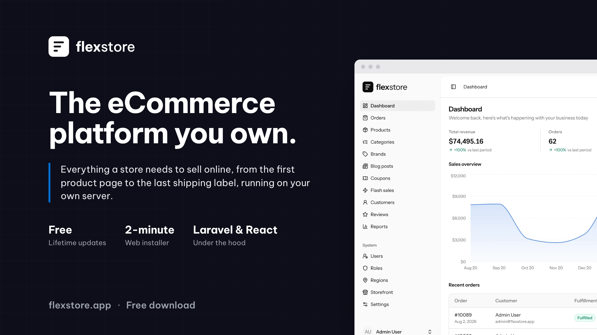

  

# FlexStore

A modern, flexible e-commerce platform built with Laravel, React, Inertia.js, and Tailwind CSS.

[Website](https://flexstore.app) &middot; [Documentation](https://docs.flexstore.app) &middot; [Live demo](https://demo.flexstore.app)

## Tech Stack

- **Backend**: PHP 8.4, Laravel 13
- **Frontend**: React 19, Inertia.js, TypeScript
- **UI**: Tailwind CSS 4.0, shadcn UI components
- **Testing**: Pest PHP
- **Static Analysis**: PHPStan, TypeScript
- **Code Quality**: Laravel Pint, Prettier, ESLint, Rector

## Prerequisites

- PHP 8.4+
- Node.js 18+
- Composer
- SQLite 3.26.0+ / MySQL 5.7+ / MariaDB 10.3+ / PostgreSQL 10.0+

## Pro

This is the free edition: one store, one currency, one language. A one-time
license adds multi-currency, multi-language, live carrier rates and labels,
reports, returns, staff accounts and more, with no subscription.

[See pricing](https://flexstore.app/#pricing)
